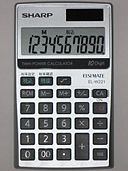

# Acknowledgement

These materials are adapted from a course developed at Cancer Research Uk Cambridge Institute by Mark Dunning, Matthew Eldridge and Thomas Carroll.

# Introduction to R - Part I

## RStudio


- Rstudio is a free environment for R
- Convenient menus to access scripts, display plots
- Still need to use *command-line* to get things done
- Developed by some of the leading R programmers
- Used by beginners, and experienced users alike

To get started, you will need to install the [latest version of R](https://cran.r-project.org/) and [RStudio Desktop](https://www.rstudio.com/products/rstudio/download3/); both of which are ***free***. 

Once installed, you should be able to launch RStudio by clicking on its icon:-


## Entering commands in R

- The traditional way to enter R commands is via the Terminal, or using the console in RStudio (bottom-left panel when RStudio opens for first time).
  + this doesn't automatically keep track of the steps you did
- Alternative, an *R script* can be used to keep a record of the commands you used.
- The R code can be run from inside the script and the results are displayed in the console or Viewer panel (eg plots)
- Each line of R code can be executed by clicking on the line and pressing CTRL and ENTER
- Let's try this now!

<div class="alert alert-info">

#### **File -> New File -> R script > ** 

</div>


```{r}
print("Hello World")
```


# Getting started



At a basic level, we can use R as a calculator to compute simple sums with the `+`, `-`, `*` (for multiplication) and `/` (for division) symbols. 

```{r}
2 + 2
2 - 2
4 * 3
10 / 2
```

The answer is displayed at the console with a `[1]` in front of it. The `1` inside the square brackets is a place-holder to signify how many values were in the answer (in this case only one). We will talk about dealing with lists of numbers shortly...

In the case of expressions involving multiple operations, R respects the [BODMAS](https://en.wikipedia.org/wiki/Order_of_operations#Mnemonics) system to decide the order in which operations should be performed.

```{r}
2 + 2 *3
2 + (2 * 3)
(2 + 2) * 3
```

R is capable of more complicated arithmetic such as trigonometry and logarithms; like you would find on a fancy scientific calculator. Of course, R also has a plethora of statistical operations as we will see.


```{r}
pi
sin (pi/2)
cos(pi)
tan(2)
log(1)
```

We can only go so far with performing simple calculations like this. Eventually we will need to store our results for later use. For this, we need to make use of *variables*.

## Variables

A variable is a letter or word which takes (or contains) a value. We
use the assignment 'operator', `<-` to create a variable and store some value in it. 

```{r}
x <- 10
x
myNumber <- 25
myNumber
```
We also can perform arithmetic on variables using functions:

```{r}
sqrt(myNumber)
```

We can add variables together:
```{r}
x + myNumber
```


We can change the value of an existing variable:

```{r}
x <- 21
x
```

- We can set one variable to equal the value of another variable:

```{r}
x <- myNumber
x
```

- We can modify the contents of a variable:

```{r}
myNumber <- myNumber + sqrt(16)
myNumber
```

When we are feeling lazy we might give our variables short names (`x`, `y`, `i`...etc), but a better practice would be to give them meaningful names. There are some restrictions on creating variable names. They cannot start with a number or contain characters such as `.`, `_`, '-'. Naming variables the same as in-built functions in R, such as `c`, `T`, `mean` should also be avoided.

Naming variables is a matter of taste. Some [conventions](http://adv-r.had.co.nz/Style.html) exist such as a separating words with `-` or using *c*amel*C*aps. Whatever convention you decided, stick with it!

## Functions

**Functions** in R perform operations on **arguments** (the inputs(s) to the function). We have already used:

```{r}
sin(x)
```

this returns the sine of x. In this case the function has one argument: **x**. Arguments are always contained in parentheses -- curved brackets, **()** -- separated by commas.


Arguments can be named or unnamed, but if they are unnamed they must be ordered (we will see later how to find the right order). The names of the arguments are determined by the author of the function and can be found in the help page for the function. When testing code, it is easier and safer to name the arguments. `seq` is a function for generating a numeric sequence *from* and *to* particular numbers. Type `?seq` to get the help page for this function.

```{r}
seq(from = 3, to = 20, by = 4)
seq(3, 20, 4)
```

Arguments can have *default* values, meaning we do not need to specify values for these in order to run the function.

`rnorm` is a function that will generate a series of values from a *normal distribution*. In order to use the function, we need to tell R how many values we want

```{r}
## this will produce a random set of numbers, so everyone will get a different set of numbers
rnorm(n=10)
```

The normal distribution is defined by a *mean* (average) and *standard deviation* (spread). However, in the above example we didn't tell R what mean and standard deviation we wanted. So how does R know what to do? All arguments to a function and their default values are listed in the help page

(*N.B sometimes help pages can describe more than one function*)

```{r}
?rnorm
```

In this case, we see that the defaults for mean and standard deviation are 0 and 1. We can change the function to generate values from a distribution with a different mean and standard deviation using the `mean` and `sd` *arguments*. It is important that we get the spelling of these arguments exactly right, otherwise R will an error message, or (worse?) do something unexpected.

```{r}
rnorm(n=10, mean=2,sd=3)
rnorm(10, 2, 3)
```

In the examples above, `seq` and `rnorm` were both outputting a series of numbers, which is called a *vector* in R and is the most-fundamental data-type.


******
******
******


### Exercise


  - What is the value of `pi` to 3 decimal places?
    + see the help for `round` `?round`
  - How can we a create a sequence from 2 to 20 comprised of 5 equally-spaced numbers?
    + check the help page for seq `?seq`
  - Create a *variable* containing 1000 random numbers with a *mean* of 2 and a *standard deviation* of 3
    + what is the maximum and minimum of these numbers?
    + what is the average?
    + HINT: see the help pages for functions `min`, `max` and `mean`
    
```{r}


```
    
    
******
******
******

## Saving your script

If you want to re-visit your code at any point, you will need to save a copy.

<div class="alert alert-info">

#### **File > Save As... > ** 
_choose workshop material directory and Create a New Folder called `scripts`_

</div>


## Packages in R

So far we have used functions that are available with the *base* distribution of R; the functions you get with a clean install of R. The open-source nature of R encourages others to write their own functions for their particular data-type or analyses.

Packages are distributed through *repositories*. The most-common ones are CRAN and Bioconductor. CRAN alone has many thousands of packages.

The **Packages** tab in the bottom-right panel of RStudio lists all packages that you currently have installed. Clicking on a package name will show a list of functions that available once that package has been loaded. 

There are functions for installing packages within R. If your package is part of the main **CRAN** repository, you can use `install.packages`

We will be using the `tidyverse` R package in this practical. To install it, we would do.

```{r eval=FALSE}
install.packages("tidyverse")
```


A package may have several *dependencies*; other R packages from which it uses functions or data types (re-using code from other packages is strongly-encouraged). If this is the case, the other R packages will be located and installed too.

**So long as you stick with the same version of R, you won't need to repeat this install process.**


Once a package is installed, the `library` function is used to load a package and make it's functions / data available in your current R session. *You need to do this every time you load a new RStudio session*. Let's go ahead and load the `tidyverse`.


```{r message=FALSE}
## tidyverse is a collection of packages for data manipulation and visualisation
library(tidyverse)
```


# Dealing with data

The [***tidyverse***](https://www.tidyverse.org/) is in fact an eco-system of packages that provides a consistent, intuitive system for data manipulation and visualisation in R.


_Image Credit:_ [***Aberdeen Study Group***](https://aberdeenstudygroup.github.io/studyGroup/lessons/SG-T2-JointWorkshop/PopulationChangeSpeciesOccurrence/)

We are going to explore some of the basic features of the `tidyverse` using data from the [gapminder](https://www.gapminder.org/data/) project, which have been bundled into an [R package](https://github.com/jennybc/gapminder). These data give various indicator variables for different countries around the world (life expectancy, population and Gross Domestic Product). We have saved these data as a `.csv` file called `gapminder.csv` in a sub-directory called `raw_data/` to demonstrate how to import data into R.


You can download these data, along with the rest of the material needed for today's workshop and a copy of this handout  [here](https://github.com/sheffield-bioinformatics-core/r-crash-course/raw/master/CourseData.zip). Save the `.zip` file somewhere on your computer and unzip it.


## Working in Rstudio Projects

We are also going to be working in an Rstudio [Project](https://support.rstudio.com/hc/en-us/articles/200526207-Using-Projects). We suggest you **organize each data analysis into a project: a folder on your computer containing all files relevant to a particular piece of work.**

There are a number of benefits to this practice in general, and the Rstudio implementation in particular, summarised in Jenny Bryan's blogpost on [Project-oriented workflows](https://www.tidyverse.org/articles/2017/12/workflow-vs-script/).

In general makes work: 

- Self-contained
- Portable

RStudio fully supports Project-based workflows, making it easy to switch from one to another, have many projects open at once, re-launch recently used Projects, etc.

There are **a few ways to create new Projects**. We can start new Projects by creating a new directory. We can also **turn an existing directory into a Project**. Let's do this with the unzipped folder containing the workshop materials we just downloaded.


<div class="alert alert-info">

#### **File > New Project > Existing Directory > ...** 
_choose workshop material directory_

</div>

We've now turned our workshop material folder into an Rstudio project and launched it, which means:

- a **fresh R session has been launched** (see how the **Environment** tab is now clear)
- the **working directory has been set to the project root** (you can check this form the header on the Console tab)
- A project specific **History** is initiated.


## Working in R Notebooks

We'll also be working in an [**R Notebook**](https://bookdown.org/yihui/rmarkdown/notebook.html). These file are an [R Markdown](https://bookdown.org/yihui/rmarkdown/) document type, which allow us to **combine R code with** [markdown](https://pandoc.org/MANUAL.html#pandocs-markdown), **a documentation language**, providing a framework for [literate programming](https://en.wikipedia.org/wiki/Literate_programming).  In an R Notebook, R code chunks can be executed independently and interactively, with output visible immediately beneath the input.

**Let's open an R Notebook to start work in.**

<div class="alert alert-info">

#### **File > Open File >** 

- Navigate to the file `notes.Rmd` in the course materials

</div>

Each chunk of R code looks something like this.

    `r ''````{r}
    print('hello world!')
    ```

New R code chunks can be inserted by: 

- keyboard shortcut: `Ctrl + Alt + I` (macOS: `Cmd + Option + I`) 
- `Insert` menu in the editor toolbar.

Each line of R in the chunks can be again executed by clicking on the line or highlighting code and pressing `Ctrl + Enter` (macOS: `Cmd + Enter`), or you can press the green triangle on the right-hand side to run everything in the chunk.


_For more details, check out this [short tutorial](https://annakrystalli.me/literate-programming/) on literate programming in R Markdown_

Let's clear everything and write our first markdown and chunk of code by creating a `markdown` header with:

```
# Packages
```


and loading the tidyverse packages for the analysis in our notebook

    `r ''````{r load-packages}
    library("tidyverse")
    ```

```{r load-packages, message=FALSE}
library("tidyverse")
```

<br>


## Reading in data

Any `.csv` file can be imported into R by supplying the path to the file to `readr` function `read_csv` and assigning it to a new object to store the result. A useful sanity check is the `file.exists` function which will print `TRUE` is the file can be found in the working directory.

```{r}
gapminder_path <- "raw_data/gapminder.csv"
file.exists(gapminder_path)
```


Assuming the file can be found, we can use `read_csv` to import. Other functions can be used to read tab-delimited files (`read_delim`) or a generic `read.table` function. A data frame object is created.

```{r}
gapminder <- read_csv(gapminder_path)
```

<div class="alert alert-warning">

**Question: Why would specifying `gapminder_path` as **
```
gapminder_path <- "/Users/Anna/Documents/workflows/workshops/r-crash-course/raw_data/gapminder.csv"
```

**be a bad idea?**

</div>


The data frame object in R allows us to work with **"tabular" data**, like we might be used to dealing with in Excel, where our data can be thought of having **rows and columns**. The values in **each column** have to all be of the **same type** (i.e. all numbers or all text).

In Rstudio, you can **view the contents of the data frame** we have just created using function `View()`. This is useful for interactive exploration of the data, but not so useful for automation, scripting and analyses.

```{r eval=FALSE}
View(gapminder)
```

```{r, echo = FALSE}
gapminder
```


We should **always check the data frame that we have created**. Sometimes R will happily read data using an inappropriate function and create an object without raising an error. However, the data might be unsuable. Consider:-

```{r}
test <- read_table(gapminder_path)
```

```{r, eval=F}
View(test)
```

```{r, echo = FALSE}
test
```

Quick sanity checks can also be performed by inspecting details in the environment tab. A useful check in RStudio is to use the `head` function, which prints the first 6 rows of the data frame to the screen.

```{r}
head(gapminder)
```


## Accessing data in columns

In the next section we will explore in more detail how to control the columns and rows from a data frame that are displayed in RStudio. For now, accessing all the observations from a particular column can be achieved by typing the `$` symbol after the name of the data frame followed by the name of a column you are interested in.

RStudio is able to *"tab-complete"* the column name, so typing the following and presssing the **TAB** key will bring-up a list of possible columns. The contents of the column that you select are then printed to the screen.

```{r eval=FALSE}
gapminder$c
```

Rather than merely printing to the screen we can also create a variable

```{r}
country_vec <- gapminder$country
```

******
******
******


### Exercise

- The function `tail` is similar to `head` except it prints the *last* lines in a file. Use this function to print the last *10* lines in the data frame (you will have to consult the help on `tail` to see how to change the default arguments.)
- What is the largest observed population?
- What is the lowest life expectancy

******
******
******


<div class="alert alert-warning">

**Question: Familiarise yourself with the contents of the data frame. What numerical summaries can you produce from the dataset (e.g. average life expectancy per-year, countries that are most wealthy etc) and what plots might be of interest? Discuss with your neighbours**

</div>
