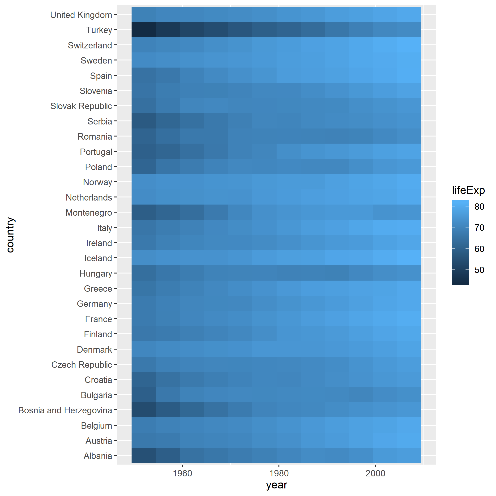

# Introduction to R - Part II


<div class="warning">
If you have previously-attended this course and are reviewing the notes, please be aware of some re-organisation of the materials in this section. Some of the later examples have been moved to Part 3.
</div>


We should have loaded the `readr` library and imported an example dataset into R

```{r message=FALSE}
library(readr)
gapminder <- read_csv("raw_data/gapminder.csv")
```


## Manipulating Columns

We are going to use functions from the **`dplyr`** package to **manipulate the data frame** we have just created. It is perfectly possible to work with data frames using the functions provided as part of "*base R*". However, many find it easy to read and write code using `dplyr`.

There are **many more functions available in `dplyr`** than we will cover today. An overview of all functions is given in a cheatsheet.

<div class="information">

- [dplyr cheatsheet](https://www.rstudio.com/wp-content/uploads/2015/02/data-wrangling-cheatsheet.pdf). The cheatsheet is also available through the RStudio Help menu.

</div>

Before using any of these functions, we need to load the library:- 

```{r message=FALSE}
library(dplyr)
```


### `select`ing columns


We can **access the columns** of a data frame using the `select` function. 

#### by name

Firstly, we can select column by name, by adding bare column names (i.e. not requiring quote marks around the name) after the name of the data frame, separated by a `,` . 

```{r}
select(gapminder, country, continent)
```

<div class="warning">
As we have to type the column names manually (no auto-complete!), we have to make sure we type the name exactly as it appears in the data. If `select` sees a name that doesn't exist in the data frame it should give an informative message
`Error: Can't subset columns that don't exist.`
</div>

We can also omit columns from the ouput by putting a minus (`-`) in front of the column name. Note that this is not the same as removing the column from the data permanently.

```{r}
select(gapminder, -country)
```

#### range of columns

A range of columns can be selected by the `:` operator.

```{r}
select(gapminder, lifeExp:gdpPercap)
```

#### helper functions 

There are a number of helper functions can be employed if we are unsure about the exact name of the column.

```{r}
select(gapminder, starts_with("co"))
select(gapminder, contains("life"))
# selecting the last and penultimate columns
select(gapminder, last_col(1),last_col())
```

It is also possible to use the column number in the selection.

```{r}
select(gapminder, 4:6)
```

<div class="exercise">
**Question**: Why might using the number of the column sometimes be problematic? Consider what might happen if you wrote code to select the last column of data from a file using the column number. What would happen if the number of columns in the file was not constant?
</div>

The `select` function can be used with just a single column name - in a similar manner to the `$` operation we saw last time. However, `select` always returns a *data frame* whereas `$` gives a vector. Compare the output of the following code chunks

```{r}
select(gapminder, pop)
```

```{r eval=FALSE}
gapminder$pop
```

The consequence of this is that you cannot use functions such as `mean` in combination with `select`

```{r eval=FALSE}
pops <- select(gapminder, pop)
mean(pops)
```

In the next session we will see how to calculate summary statistics on particular columns in our data. For now, a useful function is `pull` that will return the correct type of data required for a function such as `mean`.

```{r}
pops <- pull(gapminder,pop)
mean(pops)
```


## Restricting rows with filter

So far we have been returning all the rows in the output. We can use what we call a **logical test** to **filter the rows** in a data frame. This logical test will be applied to each row and give either a `TRUE` or `FALSE` result. When filtering, **only rows with a `TRUE` result get returned**.

For example we filter for rows where the `lifeExp` variable is less than 40. 

```{r}
filter(gapminder, lifeExp < 40)
```

Internally, R creates a *vector* of `TRUE` or `FALSE`; one for each row in the data frame. This is then used to decide which rows to display.

Testing for equality can be done using `==`. This will only give `TRUE` for entries that are *exactly* the same as the test string. 

```{r}
filter(gapminder, country == "Zambia")
```

N.B. For partial matches, the `grepl` function and / or *regular expressions* (if you know them) can be used.

```{r}
filter(gapminder, grepl("land", country))
```

We can also test if rows are *not* equal to a value using  `!=` 

```{r}
filter(gapminder, continent != "Europe")
```

### testing more than one condition

There are a couple of ways of testing for more than one pattern. The first uses an *or* `|` statement. i.e. testing if the value of `country` is `Zambia` *or* the value is `Zimbabwe`. Remember to use double `=` sign to test for string equality; `==`.


```{r}
filter(gapminder, country == "Zambia" | country == "Zimbabwe")
```


The `%in%` function is a convenient function for testing which items in a vector correspond to a defined set of values.

```{r}
filter(gapminder, country %in% c("Zambia", "Zimbabwe"))
```


We can require that both tests are `TRUE`,  e.g. which years in Zambia had a life expectancy less than 40, by separating conditional statements by a `,`. This performs an *AND* test so only rows that meet both conditions are returned.

```{r}
filter(gapminder, country == "Zambia", lifeExp < 40)
```

<div class="information">
You may have noticed that `filter` will always output the same number of columns as the input data frame. `filter` never changes the columns that are displayed. There are ways of using `filter` in conjunction with `select` as we will see later.
</div>

******
******
******

## Exercise
<div class="exercise">
- Create a subset of the data where the population less than a million in the year 2002
- Create a subset of the data where the life expectancy is greater than 75 in the years prior to 1987
- Create a subset of the European data where the life expectancy is between 75 and 80 in the years 2002 or 2007.
- If you are finished with these, try to explore alternative ways of performing the same filtering
</div>
******
******
******


## Manipulating the values in a column / creating new columns

As well as selecting existing columns in the data frame, new columns can be created and existing ones manipulated using the `mutate` function. Typically a function or mathematical expression is applied to data in existing columns by row, and the result either stored in a new column or reassigned to an existing one. In other words, the number of values returned by the function must be the same as the number of input values. Multiple mutations can be performed in one line of code.

Here, we create a new column of population in millions (`PopInMillions`) and round `lifeExp` to the nearest integer.

```{r}
mutate(gapminder, PopInMillions = pop / 1e6,
       lifeExp = round(lifeExp))
```
Note that we haven't actually changed our `gapminder` data frame. If we wanted to make the new columns permanent, we would have to create a new variable.

If we want to rename existing columns, and not create any extra columns, we can use the `rename` function.

```{r}
rename(gapminder, GDP=gdpPercap)
```


## Ordering / sorting

The whole data frame can be re-ordered according to the values in one column using the `arrange` function. So to order the table according to population size:-

```{r}
arrange(gapminder, pop)
```


The default is `smallest --> largest` but we can change this using the `desc` function

```{r}
arrange(gapminder, desc(pop))
```

`arrange` also works on character vectors, arrange them alpha-numerically.

```{r}
arrange(gapminder, desc(country))
```

We can even order by more than one condition

```{r}
arrange(gapminder, year, pop)
```


```{r}
arrange(gapminder, year, continent, pop)
```

## Saving data frames

A final point on data frames is that we can write them to disk once we have done our data processing. 

Let's create a folder in which to store such processed, analysis ready data

```{r, warning=FALSE, message=FALSE}
dir.create("out_data",showWarnings = FALSE)
## showWarnings will stop a message from appearing if the directory already exists
```


```{r}
byWealth <- arrange(gapminder, desc(gdpPercap))
# check the output before writing
head(byWealth)
write_csv(byWealth, file = "out_data/by_wealth.csv")
```

We will now try an exercise that involves using several steps of these operations

******
******
******

## Exercise
<div class="exercise">
- Filter the data to include just observations from the year 2002
- Re-arrange the table so that the countries from each continent are ordered according to decreasing wealth. i.e. the wealthiest countries first
- Select all the columns apart from year 
- Write the data frame out to a file in `out_data/` folder
</div>
```{r echo=FALSE}


```


******
******
******


## "Piping"

As have have just seen, we will often need to perform an analysis, or clean a dataset, using several `dplyr` functions in sequence. e.g. filtering, mutating, then selecting columns of interest (possibly followed by plotting - see shortly).

As a small example; if we wanted to filter our results to just Europe the `continent` column becomes redundant so we might as well remove it.

The following is perfectly valid R code, but invites the user to make mistakes and copy-and-paste erros when writing it. We also have to create multiple copies of the same data frame.

```{r}
tmp <- filter(gapminder, continent == "Europe")
tmp2 <- select(tmp, -continent)
tmp2
```

(Those familiar with Unix may recall that commands can be joined with a pipe; `|`)

In R, `dplyr` commands to be linked together and form a workflow. The symbol `%>%` is pronounced **then**. With a `%>% ` the input to a function is assumed to be the output of the previous line. All the `dplyr` functions that we have seen so far take a data frame as an input and return an altered data frame as an output, so are amenable to this type of programming.

The example we gave of filtering just the European countries and removing the `continent` column becomes:-


```{r}
filter(gapminder, continent=="Europe") %>% 
  select(-continent)
```


******
******
******

#### Exercise

<div class="exercise">
- Re-write your solution to the previous exercise, but using the ` %>% ` symbol

</div>

```{r}


```


******
******
******

# Plotting

The R language has extensive graphical capabilities.

Graphics in R may be created by many different methods including base graphics and more advanced plotting packages such as lattice.

The `ggplot2` package was created by Hadley Wickham and provides a intuitive plotting system to rapidly generate publication quality graphics.

`ggplot2` builds on the concept of the “Grammar of Graphics” (Wilkinson 2005, Bertin 1983) which describes a consistent syntax for the construction of a wide range of complex graphics by a concise description of their components.

## Why use ggplot2?

The structured syntax and high level of abstraction used by ggplot2 should allow for the user to concentrate on the visualisations instead of creating the underlying code.

On top of this central philosophy ggplot2 has:

- Increased flexibility over many plotting systems.
- An advanced theme system for professional/publication level graphics.
- Large developer base – Many libraries extending its flexibility.
- Large user base – Great documentation and active mailing list.

<div class="information">

It is always useful to think about the message you want to convey and the appropriate plot before writing any R code. Resources like [data-to-viz.com](https://www.data-to-viz.com/) should help.
</div>

With some practice, `ggplot2` makes it easier to go from the figure you are imagining in our head (or on paper) to a publication-ready image in R.

<div class="information">
As with `dplyr`, we won't have time to cover all details of `ggplot2`. This is however a useful [cheatsheet](https://raw.githubusercontent.com/rstudio/cheatsheets/main/data-visualization.pdf) that can be printed as a reference. The cheatsheet is also available through the RStudio Help menu.
</div>

## Basic plot types

A plot in `ggplot2` is created with the following type of command

```
ggplot(data = <DATA>, mapping = aes(<MAPPINGS>)) +  <GEOM_FUNCTION>()
```

So we need to specify

- The data to be used in graph
- Mappings of data to the graph (*aesthetic* mapping)
- What type of graph we want to use (The *geom* to use).

Lets say that we want to explore the relationship between GDP and Life Expectancy. We might start with the hypothesis that richer countries have higher life expectancy. A sensible choice of plot would be a *scatter plot* with gdp on the x-axis and life expectancy on the y-axis.

The first stage is to specify our dataset

```{r}
library(ggplot2)
ggplot(data = gapminder)
```

For the aesthetics, as a bare minimum we will map the `gdpPercap` and `lifeExp` to the x- and y-axis of the plot. Some progress is made; we at least get axes

```{r}
ggplot(data = gapminder,aes(x=gdpPercap, y=lifeExp))
```

That created the axes, but we still need to define how to display our points on the plot. As we have continuous data for both the x- and y-axis, `geom_point` is a good choice.

```{r}
ggplot(data = gapminder,aes(x=gdpPercap, y=lifeExp)) + geom_point()
```


The *geom* we use will depend on what kind of data we have (continuous, categorical etc)

- `geom_point()` - Scatter plots
- `geom_line()` - Line plots
- `geom_smooth()` - Fitted line plots
- `geom_bar()` - Bar plots
- `geom_boxplot()` - Boxplots
- `geom_jitter()` - Jitter to plots
- `geom_histogram()` - Histogram plots
- `geom_density()` - Density plots
- `geom_text()` - Text to plots
- `geom_errorbar()` - Errorbars to plots
- `geom_violin()` - Violin plots
- `geom_tile()` - for "heatmap"-like plots


Boxplots are commonly used to visualise the distributions of continuous data. We have to use a categorical variable on the x-axis such as `continent` or `country` (not advisable in this case as there are too many different values). 

The order of the boxes along the x-axis is dictated by the order of categories in the factor; with the default for names being alphabetical order.

```{r}
ggplot(gapminder, aes(x = continent, y=gdpPercap)) + geom_boxplot()
```


```{r}
ggplot(gapminder, aes(x = gdpPercap)) + geom_histogram()
```

Producing a barplot of counts only requires an `x` variable. The counts will be generated by R. 

```{r}
ggplot(gapminder, aes(x=continent)) + geom_bar()
```

The height of the bars can also be mapped directly to numeric variables in the data frame if the `geom_col` function is used instead. 

In the below plot the axis labels will be messy and difficult to read. This is something that can be customised with some of the `ggplot2` options we will explore later.

```{r}
gapminder2002 <- filter(gapminder, year==2002,continent=="Americas")
ggplot(gapminder2002, aes(x=country,y=gdpPercap)) + geom_col()
```

Where appropriate, we can add multiple layers of `geom`s to the plot. For instance, a criticism of the boxplot is that it does not show all the data. We can rectify this by overlaying the individual points.

```{r}
ggplot(gapminder, aes(x = continent, y=gdpPercap)) + geom_boxplot() + geom_point()
```

```{r}
ggplot(gapminder, aes(x = continent, y=gdpPercap)) + geom_boxplot() + geom_jitter(width=0.1)
```


******
******
******

### Exercises

<div class="exercise">
- The violin plot is a popular alternative to the boxplot. Create a violin plot with `geom_violin` to visualise the differences in GDP between different continents.
- Create a subset of the `gapminder` data frame containing just the rows for your country of birth
- Has there been an increase in life expectancy over time?
    + visualise the trend using a scatter plot (`geom_point`), line graph (`geom_line`) or smoothed line (`geom_smooth`).
- What happens when you modify the `geom_boxplot` example to compare the gdp distributions for different years?
    + Look at the message `ggplot2` prints above the plot and try to modify the code to give a separate boxplot for each year
</div>

******
******
******


```{r}

```


As we have seen already, `ggplot` offers an interface to create many popular plot types. It is up to the user to decide what the best way to visualise the data.


## Customising the plot appearance

Our plots are a bit dreary at the moment, but one way to add colour is to add a `col` argument to the `geom_point` function. The value can be any of the pre-defined colour names in R. These are displayed in this [handy online reference](http://www.stat.columbia.edu/~tzheng/files/Rcolor.pdf). *R*ed, *G*reen, *B*lue of *Hex* values can also be given.

```{r}
ggplot(gapminder, aes(x = gdpPercap, y=lifeExp)) + geom_point(col="red")
```

```{r}
# Use the Hex codes from Farrow and Ball: https://convertingcolors.com/list/farrow-ball.html
# (cook's blue)

ggplot(gapminder, aes(x = gdpPercap, y=lifeExp)) + geom_point(col="#6A90B4")
```


However, a powerful feature of `ggplot2` is that colours are treated as aesthetics of the plot. In other words we can use a column in our dataset.

Let's say that we want points on our plot to be coloured according to continent. We add an extra argument to the definition of aesthetics to define the mapping. `ggplot2` will even decide on colours and create a legend for us.

```{r}
ggplot(gapminder, aes(x = gdpPercap, y=lifeExp,col=continent)) + geom_point()
```

It will even choose a continuous or discrete colour scale based on the data type. We have already seen that `ggplot2` is treat our `year` column as numerical data; which is probably not very useful for visualisation.

```{r}
ggplot(gapminder, aes(x = gdpPercap, y=lifeExp,col=year)) + geom_point()
```

We can force `ggplot2` to treat `year` as categorical data by using `as.factor` when creating the aesthetics.

```{r}
ggplot(gapminder, aes(x = gdpPercap, y=lifeExp,col=as.factor(year))) + geom_point()
```

When used in the construction of a boxplot, the `col` argument will change the colour of the lines. To change the colour of the boxes we have to use `fill`.

```{r}
ggplot(gapminder, aes(x = continent, y=gdpPercap,fill=continent)) + geom_boxplot()
```


******
******
******

### Exercises before the next session
<div class="exercise">
- Using the `filter` function, find all countries that start with the letter Z
  + Hint: You can find the first letter of each country using the `substr` function. The `mutate` function can then be used to add a new column to the data.
- Use `geom_tile` to create a heatmap visualising life expectancy over time for European countries. You will need to work out what `aes`thetics to specify for a `geom_tile` plot
</div>

******
******
******

An example plot is shown on the compiled notes.




## Appendix

### Adding text to a plot

Annotations can be added to a plot using the flexible `annotate` function documented [here](https://ggplot2.tidyverse.org/reference/annotate.html). This presumes that you know the coordinates that you want to add the annotations at.

```{r}
p<- ggplot(gapminder, aes(x = gdpPercap, y = lifeExp,col=continent)) + geom_point()
p + annotate("text", x = 90000,y=60, label="Some text")
```

Highlighting particular points of interest using a rectangle.

```{r}
p + annotate("rect", xmin=25000, xmax=120000,ymin=50,ymax=75,alpha=0.2)
```


We can also map directly from a column in our dataset to the `label` aesthetic. However, this will label all the points which is rather cluttered in our case

```{r}
ggplot(gapminder, aes(x = gdpPercap, y = lifeExp,col=continent,label=country)) + geom_point() + geom_text()
```

Instead, we could use a different dataset when we create the text labels with `geom_text`. Here we filter the `gapminder` dataset to only countries with `gdpPercap` greater than `57000` and only these points get labeled. We can also set the text colours to a particular value rather than using the original colour mappings for the plot (based on continent).

```{r}
p + geom_text(data = filter(gapminder, gdpPercap > 57000), 
              aes(x = gdpPercap, y = lifeExp,label=country),col="black")
```

```{r}
p + geom_text(data = filter(gapminder, gdpPercap > 25000, lifeExp < 75), 
              aes(x = gdpPercap, y = lifeExp,label=country),col="black",size=3) + annotate("rect", xmin=25000, xmax=120000,ymin=50,ymax=75,alpha=0.2)
```


### Comment about the axis scale

The plot of `gdpPercap` vs `lifeExp` on the original scale seems to be influenced by the outlier observations (which we now know are observations from `Kuwait`). In such situations it may be possible to transform the scale of one axis for visualisation purposes. One such transformation is `log10`, which we can apply with the `scale_x_log10` function. Others include `scale_x_log2`, `scale_x_sqrt` and equivalents for the y axis.

```{r}
p + scale_x_log10()
```

By splitting the plot by continents we see more clearly which continents have a more linear relationship. At the moment this is useful for visualisation purposes, if we wanted to obtain summaries from the data we would need the techniques in the next section.

```{r}
p + scale_x_log10() + geom_smooth(method="lm",col="black") + facet_wrap(~continent)
```

